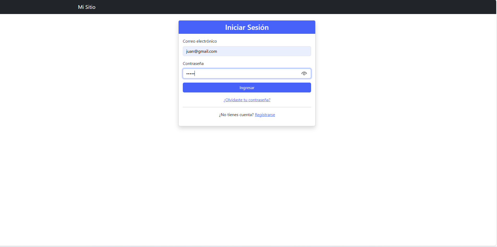
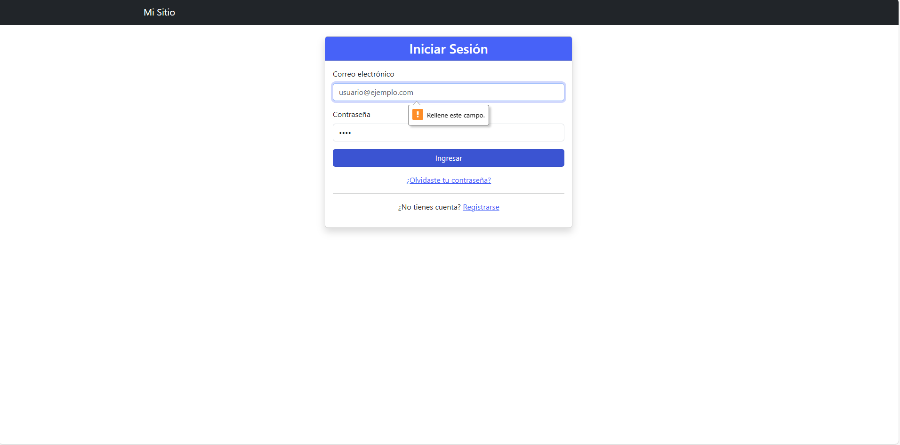
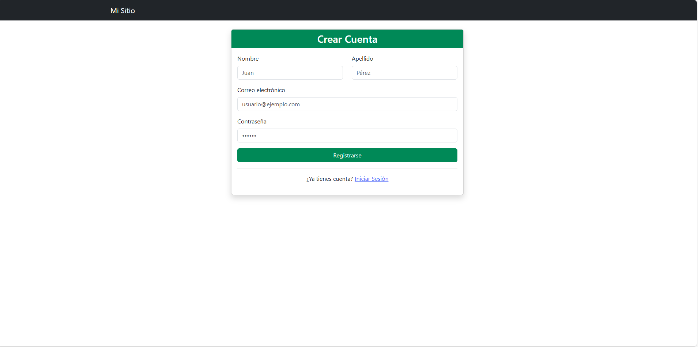
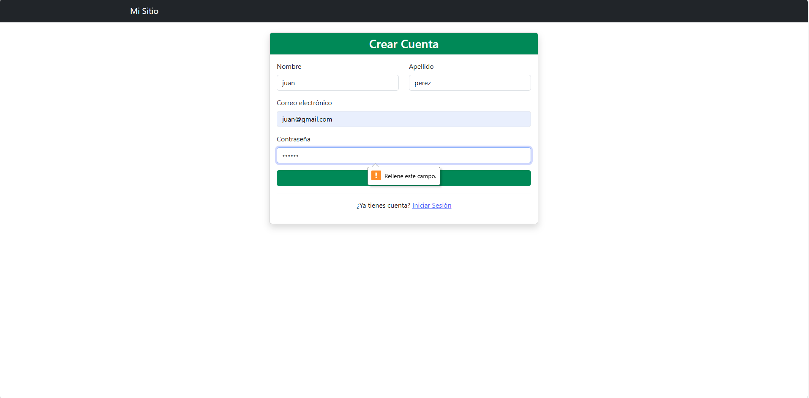
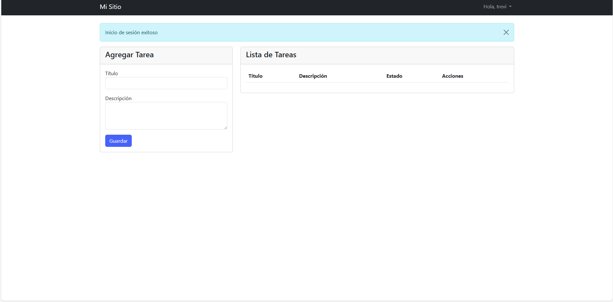
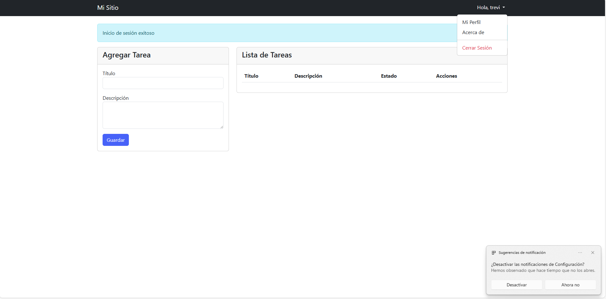
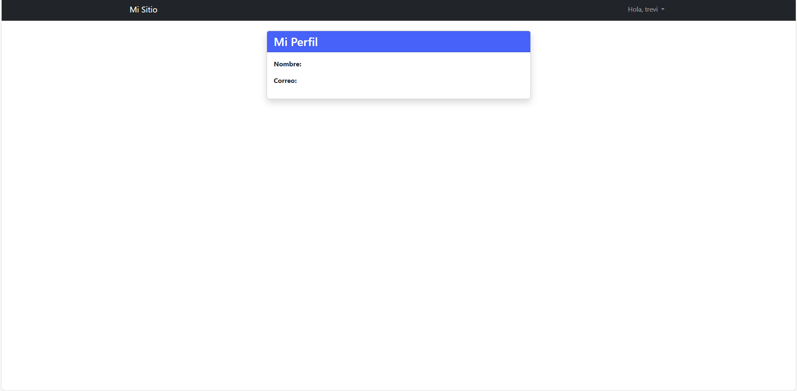
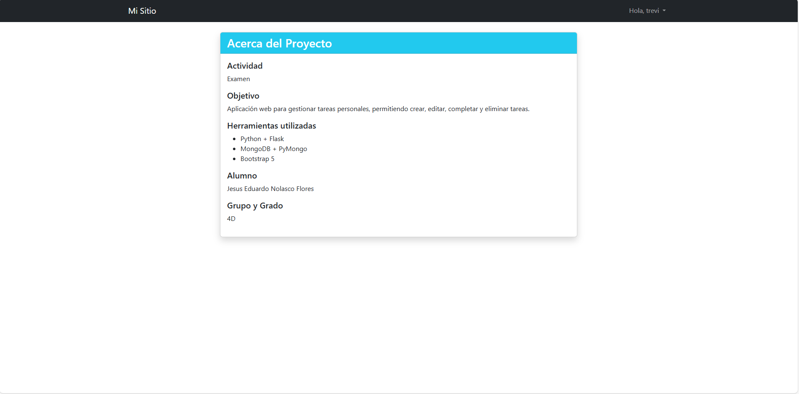
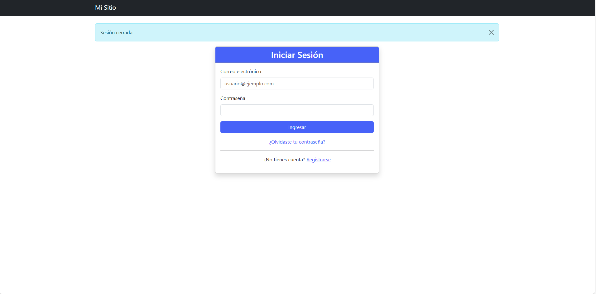

Inicio de session

Error por falta de datos

Registro

Error por falta de datos en registro

Error por falta de datos en registro

Menu al hacer clic en nombre de usuario

Apartado de perfil en menu de usuario

Acerca de

Cerrar sesion